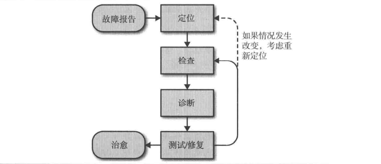

# 第十二章 有效的故障排查手段

值得警惕的是，理解一个系统应该如何工作并不能使人成为专家，只能靠调查系统为何不能正常工作才行。 ---- Brian Redman

系统正常，只是该系统无数异常情况下的一种特例。 ---- John Allspaw

## 故障排查理想模型

## 常见故障排查陷阱

- 关注了错误的现象或者错误地理解了系统现象的含义，在错误方向上浪费时间

- 不能正确修改系统的配置信息、输入信息或者系统运行环境，造成不能安全有效地测试假设

- 将问题过早地归结为极为不可能的因素或念念不忘之前曾发生过的系统问题，认为一旦发生过一次，就有可能再发生

- 试图解决与当前系统问题相关的一些问题，却没有认识到这些其实只是巧合，或者这些问题其实是由当前系统问题造成的

如何避免这些陷阱

- 要避免前两点，需要更详细地学习系统的运行原理，同时了解分布式系统运行的基本模式

- 要避免第三点，需要记住不是所有失败情况出现的概率都相同，当所有可能都存在，应该优先最简单的。

- 要避免第四点，需要记住，相关性不等于因果关系

## 实践

在实践中，故障排查过程不一定与理想模型一致。

### 故障报告

有效的故障报告应该写清楚预期是什么，实际结果是什么，以及如何重现。报告应使用统一格式，并存储进故障库，应该为每一个错误报告提交一个BUG，而不是直接报告给具体的人。

### 定位

收到一个错误报告时，应先明确其严重程度，对于大型问题，首先要尽最大可能让系统恢复服务并保存故障现场，如日志等。

如果一个BUG有可能导致不可恢复的数据损失，停止整个系统比让系统继续运行更好。

### 检查

必须能够检查系统中每个组件的工作状态以便了解整个系统是不是在正常工作：

1. 查看监控记录

2. 查看日志

3. 暴露目前的系统状态

4. 需要一个使用该系统的真是客户端

### 诊断

1. 将问题分解，逐个检查系统的每个组件，知道系统的最底层，对于大型系统可以使用对分法。

2. 找出系统目前正在执行什么，然后通过询问系统为什么正在做这些操作，以及系统的资源都被用在了哪里。

3. 检查最近对系统的修改

4. 使用针对具体系统开发的诊断工具和诊断系统

### 测试和修复

设计测试的一些考量

- 一个理想的测试应该具有互斥性，通过这个测试可以将一组假设推翻，同时确认另一组假设。

- 先测试最可能的情况，按照可能发生的顺序执行测试，同时考虑该测试对系统的危险性

- 某项测试可能产生误导的结果

- 执行测试可能带来副作用

- 某些测试无法得出准确的结论，只是建议性的

明确记录执行了哪些测试以及测试的结果。

#### 神奇的负面结果

负面结果指一项实验的预期结果没有出现，也就是该实验没有成功。

- 负面结果不应被忽略或被轻视。

- 一项实验中出现的负面结果可以明确高速我们生产环境中的信息，设计理念对错或现有系统的性能极限，并可能被再次或不同团队使用。

- 工具和方法可能超越目前的试验，为未来的工作提供帮助。

- 公布负面结果有助于提升整个行业的数据驱动风气，公布拟的实验结果，哪怕它是失败的。

### 治愈

当你最终确定了某个因素是问题根源时，应该将系统中出错的部分、定位问题的过程、修复问题的方法和防止问题再次发生的策略等记录下来。

## 使故障排查更简单

简化和加速故障排查过程的最基本方法是：

- 增加可观察性，在实现之初就给每个组件增加白盒监控指标和结构化日志

- 利用成熟的，观察性好的组件接口设计系统
